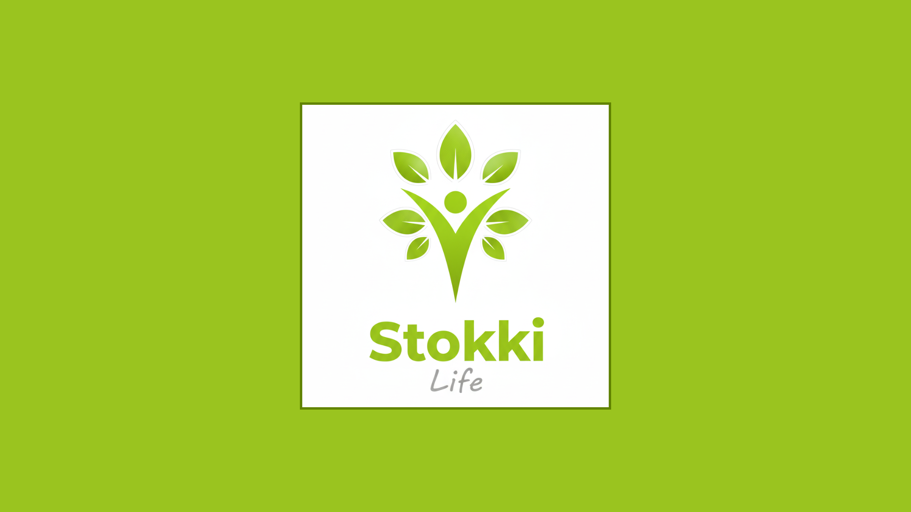

# Stokki Life: Gestão de Estoque para microempreendedores



#


# Desafio 

**O problema:** De que maneira o software pode auxiliar microempreededoresque trabalham com produtos em pó (como shakes e chás) a gerenciar seu estoque e suas vendas, garantindo mais praticidade, economia e eficiência?

**A oportunidade:** Melhora microempreendimentos, reduz perdas, otimiza reposições e oferece dados em tempo real, impulsionando a sustentabilidade e o crescimento dos negócios.
#

# Solução: Stokki Life

No estudo de caso em questão, analisamos a microempreendedora Alessandra Campos, que possui um espaço de vida saudável, onde oferece shakes e chás preparados a partir de produtos em pó. A principal dificuldade encontrada está no controle de estoque, tanto em relação ao prazo de validade dos produtos quanto à reposição de itens de maior saída.

#

# Hipótese

A implementação do Stokki-Life em microempreendimentos, visa tornar a gestão de estoque e vendas mais eficiente, reduzindo perdas por vencimento e descontrole, otimizando a reposição de produtos e oferecendo acesso em tempo real a dados comerciais. Essa melhoria operacional e informacional é vista como essencial para a sustentabilidade econômica, permitindo uma alocação mais inteligente do capital de giro e foco no crescimento dos negócios.

#

# Tecnologias utilizadas


#

# Passo a Passo de como instalar Stokki Life:

O projeto utiliza **Laravel** e requer **XAMPP** (ou outro ambiente PHP/MySQL) e **Composer** para gerenciamento de dependências.

### 1. Pré-requisitos Essenciais

Certifique-se de que os seguintes programas estão instalados em seu computador:

-   **XAMPP** (ou um ambiente equivalente como MAMP, WAMP, ou Docker) para hospedar o servidor web (Apache) e o banco de dados (MySQL).
    
-   **Composer:** Gerenciador de dependências para PHP.
    
-   **Node.js e npm (ou Yarn):** Para gerenciar e compilar os assets de front-end.
    
-   **Git:** Para clonar o repositório.
    

### 2. Clonagem do Repositório

Abra seu terminal ou prompt de comando, navegue até o diretório onde deseja armazenar seus projetos e execute o comando `git clone`, substituindo `[Link do Repositório]` pelo link correto do GitHub:

Bash

```
git clone [Link do Repositório]
```

### 3. Configuração no Ambiente Local

Após a clonagem, mova a pasta do projeto para o diretório de documentos raiz do seu servidor local (`htdocs` se estiver usando XAMPP, geralmente em `C:\xampp\htdocs` ou `\Applications\XAMPP\htdocs`).

Em seguida, navegue até a pasta do projeto no terminal e instale as dependências:

-   **Dependências PHP (Composer):**
    
    Bash
    
    ```
    composer install
    ```
    
-   **Dependências Front-end (npm):**
    
    Bash
    
    ```
    npm install
    npm run build
    ```
    
    _(O comando `npm run build` compila os assets CSS/JS para produção/uso.)_
    

### 4. Configuração do Laravel e Segurança

Gere a chave de criptografia do aplicativo e configure o banco de dados:

-   **Gerar Chave de Aplicativo (.env):**
    
    Bash
    
    ```
    php artisan key:generate
    
    ```
    
    > **OBSERVAÇÃO DE SEGURANÇA:** Este comando gera uma chave na variável `APP_KEY` do arquivo `.env`. Para sua segurança, **é crucial que você apague esta chave** (deixando o campo vazio, ou a linha excluída) **antes de subir o projeto para um repositório público (GitHub, etc.)**. A chave deve ser gerada individualmente em cada ambiente de instalação.
    

### 5. Configuração e Execução do Banco de Dados

Execute as migrações para criar as tabelas no seu banco de dados MySQL. Certifique-se de que o **Apache** e o **MySQL** do seu XAMPP estejam **ativos** antes de rodar este comando:

Bash

```
php artisan migrate
```

_Este comando executa todos os arquivos na pasta `database/migrations`, configurando a estrutura do banco de dados._

### 6. Inicialização do Servidor Local

Com todas as dependências instaladas e o banco de dados configurado, você pode iniciar o servidor de desenvolvimento do Laravel:

Bash

```
# Opção 1: Comando padrão do Laravel
php artisan serve

# Opção 2: Ou usando o script de desenvolvimento do Composer (se configurado)
composer run dev
```

O projeto estará acessível através do link:

```
http://127.0.0.1:8000